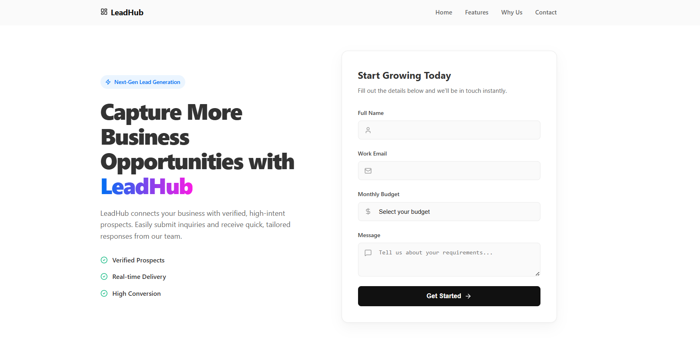
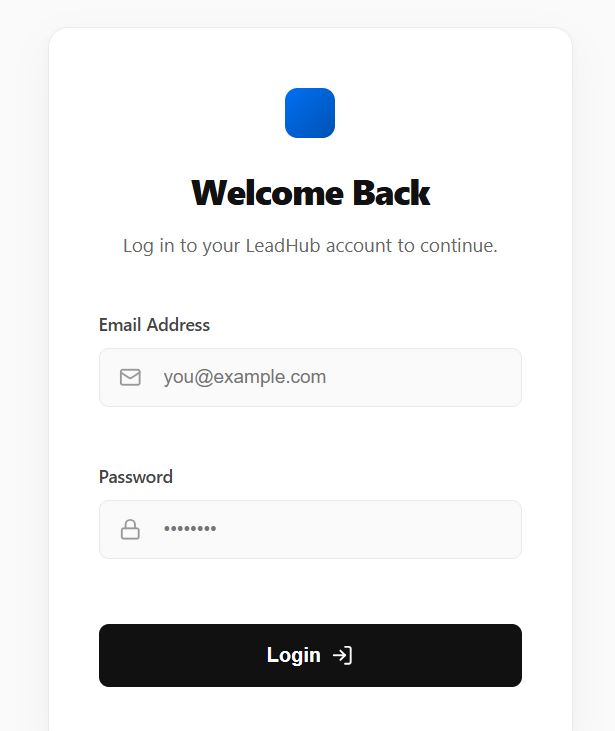
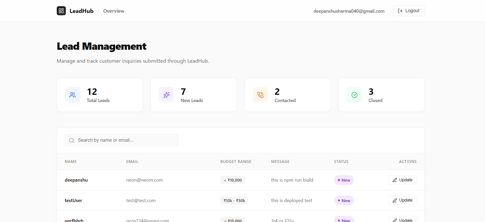
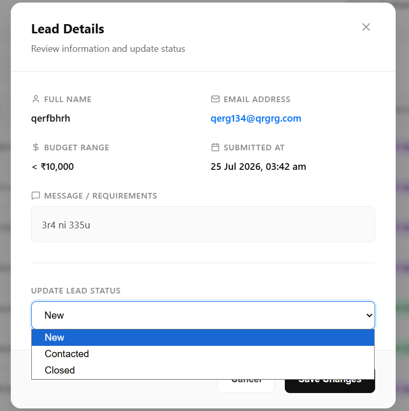
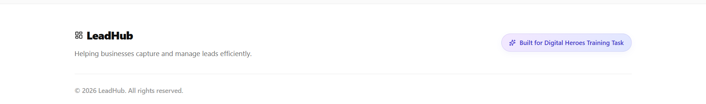

# 🚀 LeadHub

**A Full-Stack Lead Management System**

LeadHub is a production-ready full-stack application built for the Digital Heroes Full Stack Development Internship Qualification Task. It includes a public landing page for capturing leads and a secure admin dashboard for managing them.

---

## 🚀 Live Demo

**Application:Landing Page**  
https://leadhub-vouo.onrender.com/
**Application:Admin Dashboard**  
https://leadhub-vouo.onrender.com/admin/dashboard

---

## 📌 GitHub

## https://github.com/deepanshu855/LeadHub

## 👨‍💻 Developer

**Deepanshu Sharma**

- LinkedIn: https://www.linkedin.com/in/deepanshu-sharma-661572323/
- GitHub: https://github.com/deepanshu855

---

## 📑 Table of Contents

1. [Live Demo](#-live-demo)
2. [GitHub](#-github)
3. [Developer](#-developer)
4. [Overview](#overview)
5. [Tech Stack](#tech-stack)
6. [Features](#features)
7. [✅ Assignment Checklist](#-assignment-checklist)
8. [Project Structure](#project-structure)
9. [Frontend Architecture](#-frontend-architecture)
10. [API Endpoints](#api-endpoints)
11. [Authentication Flow](#authentication-flow)
12. [Data Model](#data-model)
13. [Validation Rules](#validation-rules)
14. [Installation & Setup](#installation--setup)
15. [Running the App](#running-the-app)
16. [Admin Registration](#admin-registration)
17. [Admin credentials](#admin-credentials)
18. [Deployment Notes](#deployment-notes)
19. [AI Usage](#ai-usage)
20. [Screenshots](#screenshots)
21. [Loom walkthrough](#loom-walkthrough)
22. [License](#license)

---

## Overview

LeadHub delivers a complete lead lifecycle experience:

- Public landing page with enquiry form
- Server-side and client-side validation
- MongoDB persistence for incoming leads
- Admin login with JWT authentication
- Protected dashboard for lead review, search, and status updates

---

## Tech Stack

**Frontend**

- React
- React Router DOM
- Axios
- React Hook Form
- Framer Motion
- React Toastify
- CSS

**Backend**

- Node.js
- Express.js
- MongoDB Atlas
- Mongoose
- JSON Web Tokens (JWT)
- Cookie Parser
- Express Validator
- bcryptjs

**Development**

- Vite
- ESLint
- Render (deployment target)

---

## Features

- Responsive landing page with lead capture form
- Budget selection and message entry
- Client-side validation for instant feedback
- Server-side validation for secure payload handling
- Lead storage in MongoDB
- Admin login and JWT-based auth
- Protected dashboard route
- Lead search and filtering
- Lead status updates: `new`, `contacted`, `close`
- Logout support

---

## ✅ Assignment Checklist

| Requirement            | Status |
| ---------------------- | ------ |
| Public Landing Page    | ✅     |
| Lead Capture Form      | ✅     |
| Client-side Validation | ✅     |
| Server-side Validation | ✅     |
| MongoDB Storage        | ✅     |
| Admin Authentication   | ✅     |
| Protected Dashboard    | ✅     |
| Search Leads           | ✅     |
| Update Lead Status     | ✅     |
| Deployment             | ✅     |
| README                 | ✅     |
| Loom Walkthrough       | ✅     |

---

## Project Structure

```
DigitalHeroes/
├── backend/
│   ├── server.js
│   ├── src/
│   │   ├── app.js
│   │   ├── config/
│   │   │   └── database.js
│   │   ├── controllers/
│   │   │   ├── auth.controller.js
│   │   │   └── lead.controller.js
│   │   ├── middlewares/
│   │   │   ├── auth.middleware.js
│   │   │   └── error.middleware.js
│   │   ├── models/
│   │   │   ├── admin.model.js
│   │   │   └── lead.model.js
│   │   ├── routes/
│   │   │   ├── admin.routes.js
│   │   │   └── lead.routes.js
│   │   └── validator/
│   │       ├── auth.validation.js
│   │       └── lead.validation.js
│   └── package.json
├── frontend/
│   ├── src/
│   │   ├── app/
│   │   │   ├── App.jsx
│   │   │   └── app.routes.jsx
│   │   ├── features/
│   │   │   ├── auth/
│   │   │   ├── dashboard/
│   │   │   ├── lead/
│   │   │   └── shared/
│   └── package.json
└── Readme.md
```

---

# 🏗 Frontend Architecture

The project follows a **4-Layer Architecture** for every feature, making the application modular, scalable, and easy to maintain.

---

## API Endpoints

### Authentication

- `POST /api/admin/login`
  - Request body: `{ email, password }`
  - Response: success token cookie + user details

- `POST /api/admin/register`
  - Request body: `{ email, password }`
  - Response: creates admin and issues token cookie

- `GET /api/admin/get-me`
  - Requires auth cookie
  - Response: current admin user details

- `GET /api/admin/logout`
  - Clears auth cookie
  - Response: logout message

### Lead Management

- `POST /api/leads`
  - Request body: `{ name, email, budgetRange, message }`
  - Response: created lead

- `GET /api/leads`
  - Protected endpoint
  - Response: list of leads

- `PATCH /api/leads/:id/status`
  - Protected endpoint
  - Request body: `{ status }`
  - Allowed values: `new`, `contacted`, `close`

---

## Authentication Flow

1. Admin submits credentials via `/admin/login`
2. Backend validates credentials and issues JWT
3. JWT is stored as a cookie
4. Protected React route `/admin/dashboard` checks auth
5. Users can log out to clear the cookie

---

## Data Model

### Lead

- `name`: string, required
- `email`: string, required, lowercase
- `budgetRange`: string, one of `< ₹10,000`, `₹10k - ₹50k`, `₹50k - ₹1L`, `> ₹1L`
- `message`: string, required
- `status`: string, one of `new`, `contacted`, `close`
- timestamps: `createdAt`, `updatedAt`

### Admin

- `email`: string, required, unique
- `password`: hashed string, required

---

## Validation Rules

### Lead payload

- `name`: required, 2-50 chars, letters and spaces only
- `email`: required, valid email format
- `budgetRange`: required, must match allowed options
- `message`: required, minimum 10 characters

### Auth payload

- `email`: required, valid email format
- `password`: required, minimum 6 characters

---

## Installation & Setup

### Backend

1. `cd backend`
2. `npm install`
3. Create `.env` with:
   - `MONGODB_URI=<your_mongo_uri>`
   - `JWT_SECRET=<your_jwt_secret>`
4. Start backend:
   - `npm run dev`

### Frontend

1. `cd frontend`
2. `npm install`
3. Start frontend:
   - `npm run dev`

---

### Running the App

- Frontend: default Vite server on `http://localhost:5173`
- Backend: `http://localhost:3000`
- Public lead form: `/`
- Admin login: `/admin/login`
- Dashboard: `/admin/dashboard` (Protected Route, can be accessed only after admin login)

---

## Admin Registration

The backend includes a **Register Admin** API for creating administrator accounts. However, in accordance with the assignment requirements and common production practices, the registration functionality is **not exposed through the frontend**.

Administrator accounts can be created by:

- Sending a request to the registration API using **Postman** or another API client.
- Temporarily enabling the registration route in the frontend during development (the code has been retained but commented out).

To prevent unauthorized administrator creation, the application enforces a maximum limit of **two administrator accounts**. Any registration attempt after this limit is reached will be rejected by the backend.

This approach ensures that only authorized users can become administrators while keeping the public application secure.

---

## Admin credentials

- email: deepanshusharma040@gmail.com
- password: 123456

---

## Deployment Notes

- Frontend and backend are built for deployment on platforms such as Render.
- Backend serves API routes from `/api/*` and uses cookie-based JWT auth.
- Ensure `JWT_SECRET` and `MONGODB_URI` are configured in production.

---

## AI Usage

AI tools were used to assist throughout development.

### ChatGPT & Github Copilot

- Understanding the problem statement
- Architecture discussions
- Validation Regex generation
- Documentation (README)

### Google Stitch

- UI inspiration
- Landing page and dashboard design concepts

### Google Gemini Pro & Antigravity

- UI implementation prompts
- HTML/CSS generation

The complete backend architecture, frontend architecture, authentication flow, business logic, database design, API implementation, deployment, testing and debugging were implemented manually by me.

---

## Screenshots

- Landing Page
  

- Admin login
  

- Admin Dashboard
  

- Lead status update
  

- Footer
  

---

## Loom walkthrough

- Video link:https://www.loom.com/share/f2e2bdeb00ba4dd29f4e1c75dbe4d29e

---

## License

This project is released under the `ISC` license.
